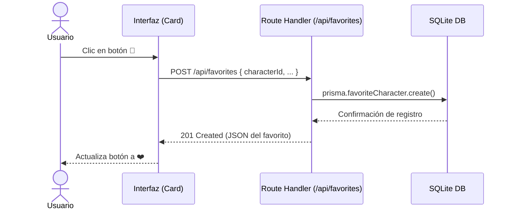
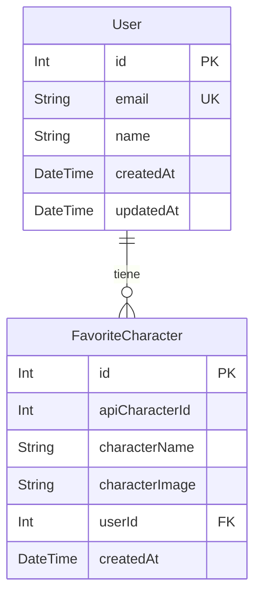

# Documento de Diseño de Software
**Norma:** 220501095 - Diseñar la solución de software de acuerdo con procedimientos y requisitos técnicos.
**Proyecto:** Sistema de Favoritos - Rick & Morty Full-Stack

## 1. Introducción del sistema
El presente documento describe el diseño de una aplicación web Full-Stack basada en el consumo de la API pública de Rick and Morty. El sistema ha evolucionado de un frontend básico a una solución completa que incorpora un backend propio y una base de datos relacional. El propósito principal es permitir a los usuarios explorar la lista de personajes y gestionar (agregar o eliminar) sus personajes favoritos, persistiendo esta información en una base de datos de forma permanente.

## 2. Requisitos
### Requisitos Funcionales
* **RF01:** El sistema debe consumir la API pública de Rick & Morty para listar los personajes.
* **RF02:** El sistema debe permitir al usuario marcar un personaje como "Favorito".
* **RF03:** El sistema debe permitir al usuario quitar un personaje de su lista de favoritos.
* **RF04:** El sistema debe mostrar una vista dedicada con la lista de todos los personajes guardados como favoritos.
* **RF05:** La información de favoritos debe guardarse en una base de datos relacional.

### Requisitos No Funcionales
* **RNF01:** La interfaz debe ser desarrollada usando Next.js 15 (App Router) y React.
* **RNF02:** El código debe usar tipado estricto con TypeScript.
* **RNF03:** El tiempo de respuesta de las peticiones a la API interna no debe superar los 500ms en condiciones normales.
* **RNF04:** El diseño debe ser responsive para adaptarse a diferentes pantallas.

## 3. Arquitectura del software
La solución utiliza una arquitectura de **Cliente-Servidor (Full-Stack)** alojada dentro del mismo entorno gracias a las capacidades de Next.js.
* **Frontend:** Next.js (Client Components) comunicándose vía fetch con el backend y la API externa.
* **Backend:** Next.js Route Handlers (Serverless/API Routes) que actúan como controladores REST.
* **Capa de Datos:** Prisma ORM interactuando con una base de datos SQLite.

### Tecnologías a utilizar
* **Frontend:** React 18, Next.js 15, CSS Modules/Inline Styles.
* **Backend:** Node.js, Next.js API Routes (Route Handlers).
* **Base de Datos:** SQLite.
* **ORM:** Prisma.
* **Lenguaje:** TypeScript.

## 4. Descripción de módulos
* **Módulo de Exploración (Home):** Encargado de consultar la API externa y presentar el catálogo de personajes en formato de cuadrícula (Cards).
* **Módulo de Favoritos (Backend):** Expone los endpoints REST (`GET`, `POST`, `DELETE` en `/api/favorites`) para interactuar con la base de datos.
* **Módulo de Gestión de Favoritos (Frontend):** Consiste en la lógica de UI que permite sincronizar el estado reactivo con el backend cada vez que se presiona el botón ❤️.
* **Módulo de Base de Datos:** Gestionado por Prisma ORM, mantiene las entidades `User` y `FavoriteCharacter`.

## 5. Justificación técnica
Se eligió **Next.js** ya que permite unificar el ciclo de desarrollo del Frontend y Backend en un solo repositorio (monorepo lógico), reduciendo la complejidad de despliegue. **SQLite** emparejado con **Prisma ORM** es la elección ideal por su nula necesidad de configuración de infraestructura externa, garantizando cumplimiento de los requerimientos académicos sobre bases relacionales de manera portable, manteniendo un tipado seguro en toda la pila (End-to-End Type Safety).

---

## 6. Diagramas UML

### 6.1. Diagrama de Casos de Uso
```mermaid
usecaseDiagram
    actor Usuario
    
    Usuario --> (Ver catálogo de personajes)
    Usuario --> (Agregar personaje a favoritos)
    Usuario --> (Eliminar personaje de favoritos)
    Usuario --> (Ver vista de "Mis Favoritos")
    
    (Agregar personaje a favoritos) ..> (Registrar en Base de Datos) : <<include>>
```

### 6.2. Diagrama de Secuencia (Agregar Favorito)


---

## 7. Modelo de Base de Datos (Relacional)

A continuación, el Diagrama Entidad-Relación (DER) de acuerdo con Prisma Schema:



* **User**: Tabla que almacena la información del usuario del sistema (para este sistema se implementa un usuario seed por defecto).
* **FavoriteCharacter**: Tabla transaccional que relaciona un personaje de la API externa con un Usuario específico del sistema. La llave foránea (`userId`) hace referencia al `id` de la tabla `User`.
