# 📋 EVIDENCIA DE PRODUCTO — NORMA 220501095

**Norma:** 220501095 – Diseñar la solución de software de acuerdo con procedimientos y requisitos técnicos.  
**Proyecto:** Sistema de Exploración y Favoritos – Rick & Morty Full-Stack  
**Autor:** Santiago López Barbosa  
**Fecha:** Abril 2026  

---

> Este documento único consolida las **cuatro (4) evidencias de producto** exigidas por la norma:
>
> | # | Producto | Sección |
> |---|---------|---------|
> | 1 | Documento de diseño de software | §1 – §5 |
> | 2 | Diagramas de Lenguaje Unificado de Modelado (UML) | §6 |
> | 3 | Prototipo de solución de software | §7 |
> | 4 | Modelo de base de datos | §8 |

---

# PRODUCTO 1 — DOCUMENTO DE DISEÑO DE SOFTWARE

---

## 1. Introducción del Sistema

El presente documento describe el diseño integral de una **aplicación web Full-Stack** construida con **Next.js 15 (App Router)**, **React 18**, **TypeScript**, **Prisma ORM** y **SQLite**. El sistema consume la API pública de *Rick and Morty* y permite a los usuarios autenticados explorar un catálogo de más de 800 personajes, aplicar filtros de búsqueda y estado vital, y gestionar una colección personal de favoritos persistida en base de datos relacional.

### 1.1. Descripción del problema a resolver

Los usuarios requieren una plataforma web donde puedan:

- Consultar de forma eficiente el extenso catálogo de personajes del universo Rick & Morty.
- Filtrar y buscar personajes por nombre o por su estado vital (vivo, muerto, desconocido).
- Marcar personajes como favoritos y acceder a una vista dedicada con su colección personal.
- Acceder al sistema de forma segura mediante autenticación con credenciales.

### 1.2. Objetivos del sistema

| Código | Objetivo |
|--------|----------|
| OBJ-01 | Proveer una interfaz web moderna y responsiva para explorar personajes de la API de Rick & Morty. |
| OBJ-02 | Implementar un sistema CRUD (Create, Read, Delete) de favoritos con persistencia en base de datos relacional. |
| OBJ-03 | Garantizar la seguridad del acceso mediante autenticación con NextAuth.js (JWT + Credentials). |
| OBJ-04 | Optimizar la experiencia de usuario con paginación infinita, skeleton loading, búsqueda con debounce y actualizaciones optimistas. |
| OBJ-05 | Mantener type-safety end-to-end utilizando TypeScript en toda la pila de desarrollo. |

### 1.3. Actores del Sistema

| Actor | Descripción |
|-------|-------------|
| **Usuario Autenticado** | Persona que ha iniciado sesión y puede explorar el catálogo, buscar/filtrar personajes, y gestionar su colección de favoritos. |
| **Usuario No Autenticado** | Persona que aún no se ha identificado; solo tiene acceso a la pantalla de login. |
| **API Externa (Rick & Morty)** | Servicio REST público (`rickandmortyapi.com`) que provee el catálogo de personajes. |
| **Base de Datos SQLite** | Almacén local relacional que persiste usuarios y personajes favoritos. |

---

## 2. Requisitos

### 2.1. Requisitos Funcionales

| ID | Requisito | Prioridad |
|----|-----------|-----------|
| RF-01 | El sistema debe consumir la API pública de Rick & Morty para listar personajes con paginación servidor-lado. | Alta |
| RF-02 | El sistema debe permitir al usuario buscar personajes por nombre con debounce de 500ms (búsqueda servidor-lado). | Alta |
| RF-03 | El sistema debe permitir filtrar personajes por estado vital: Alive, Dead, Unknown. | Alta |
| RF-04 | El sistema debe permitir al usuario autenticado agregar un personaje a su lista de favoritos (POST). | Alta |
| RF-05 | El sistema debe permitir al usuario autenticado eliminar un personaje de su lista de favoritos (DELETE). | Alta |
| RF-06 | El sistema debe mostrar una vista dedicada `/favorites` con la colección personal del usuario. | Alta |
| RF-07 | El sistema debe implementar autenticación de usuarios con email y contraseña (NextAuth Credentials). | Alta |
| RF-08 | El sistema debe mostrar estadísticas (total de personajes, total de páginas) en el dashboard. | Media |
| RF-09 | El sistema debe implementar scroll infinito para cargar páginas de personajes progresivamente. | Media |
| RF-10 | El sistema debe realizar actualizaciones optimistas al marcar/desmarcar favoritos para mejorar UX. | Media |
| RF-11 | El sistema debe impedir que un usuario guarde el mismo personaje como favorito más de una vez (restricción de unicidad). | Alta |
| RF-12 | El sistema debe redirigir automáticamente a `/login` si el usuario no está autenticado. | Alta |

### 2.2. Requisitos No Funcionales

| ID | Requisito | Categoría |
|----|-----------|-----------|
| RNF-01 | La interfaz debe ser desarrollada con Next.js 15 (App Router) y React 18. | Tecnología |
| RNF-02 | Todo el código debe utilizar tipado estricto con TypeScript 5.x. | Calidad |
| RNF-03 | El tiempo de respuesta de las peticiones a la API interna no debe superar los 500ms en condiciones normales. | Rendimiento |
| RNF-04 | El diseño debe ser responsive y adaptarse a pantallas de escritorio, tableta y móvil. | Usabilidad |
| RNF-05 | Las contraseñas deben almacenarse hasheadas con bcrypt (factor de costo 10). | Seguridad |
| RNF-06 | La sesión del usuario debe gestionarse con tokens JWT. | Seguridad |
| RNF-07 | El frontend debe implementar caching de queries con TanStack Query (staleTime: 60s). | Rendimiento |
| RNF-08 | La base de datos debe ser SQLite (archivo local, sin infraestructura externa). | Portabilidad |
| RNF-09 | El sistema debe mantener un singleton de PrismaClient para evitar connection exhaustion en desarrollo. | Estabilidad |

---

## 3. Arquitectura del Software

La solución utiliza una arquitectura **Cliente-Servidor Full-Stack monolítica** alojada dentro del mismo entorno gracias a las capacidades de Next.js. Se organiza en tres capas principales:

```
┌──────────────────────────────────────────────────────────────────────┐
│                        CAPA DE PRESENTACIÓN                         │
│  (React Client Components + TanStack Query + NextAuth React hooks)  │
│                                                                     │
│   ┌─────────────┐  ┌─────────────┐  ┌───────────────┐              │
│   │  Login Page  │  │ Home (/)    │  │ Favorites     │              │
│   │  /login      │  │ Dashboard   │  │ /favorites    │              │
│   └─────────────┘  └─────────────┘  └───────────────┘              │
│         │                │                   │                      │
│         ▼                ▼                   ▼                      │
│   ┌─────────────────────────────────────────────────────────┐       │
│   │              SERVICIOS DE CLIENTE (fetch)               │       │
│   │    api.ts (Rick&Morty API)   favorites.ts (API interna) │       │
│   └─────────────────────────────────────────────────────────┘       │
└──────────────────────────────────┬───────────────────────────────────┘
                                   │ HTTP (fetch)
┌──────────────────────────────────▼───────────────────────────────────┐
│                        CAPA DE LÓGICA DE NEGOCIO                    │
│             (Next.js Route Handlers — Serverless API)               │
│                                                                     │
│   ┌─────────────────────────┐  ┌────────────────────────────┐       │
│   │ /api/auth/[...nextauth] │  │ /api/favorites             │       │
│   │ (Autenticación JWT)     │  │ GET · POST · DELETE        │       │
│   └─────────────────────────┘  └────────────────────────────┘       │
│                    │                        │                        │
│             getServerSession         Prisma Client                   │
└──────────────────────────────────┬───────────────────────────────────┘
                                   │ Prisma ORM
┌──────────────────────────────────▼───────────────────────────────────┐
│                        CAPA DE DATOS                                │
│                    (SQLite + Prisma Schema)                          │
│                                                                     │
│   ┌───────────────┐     ┌────────────────────────┐                  │
│   │     User      │────▶│   FavoriteCharacter     │                  │
│   └───────────────┘     └────────────────────────┘                  │
└──────────────────────────────────────────────────────────────────────┘
                                   │
             ┌─────────────────────┘ (API Externa vía fetch)
             ▼
┌──────────────────────────────────────────────────────────────────────┐
│                   SERVICIO EXTERNO                                   │
│          https://rickandmortyapi.com/api/character                   │
│          (API REST pública — solo lectura)                           │
└──────────────────────────────────────────────────────────────────────┘
```

### 3.1. Tecnologías Utilizadas

| Capa | Tecnología | Versión | Propósito |
|------|-----------|---------|-----------|
| Frontend | React | 18.3.x | Librería de componentes de UI reactivos |
| Frontend | Next.js | 15.0.0 | Framework fullstack con App Router y Route Handlers |
| Frontend | TanStack Query | 5.95.x | Cache, revalidación y gestión de estado del servidor |
| Frontend | react-intersection-observer | 10.0.x | Detección de viewport para scroll infinito |
| Backend | NextAuth.js | 4.24.x | Autenticación con Credentials Provider y JWT |
| Backend | bcryptjs | 3.0.x | Hashing seguro de contraseñas |
| ORM | Prisma | 6.19.x | Mapeo objeto-relacional con type-safety |
| Base de Datos | SQLite | — | Motor relacional embebido (archivo local) |
| Lenguaje | TypeScript | 5.9.x | Superset tipado de JavaScript |

---

## 4. Descripción de Módulos

### 4.1. Módulo de Autenticación (`/login`, `/api/auth`)

| Aspecto | Detalle |
|---------|---------|
| **Responsabilidad** | Gestionar el inicio de sesión, cierre de sesión y protección de rutas. |
| **Componentes** | `LoginPage` (Client Component), `authOptions.ts`, `/api/auth/[...nextauth]/route.ts` |
| **Flujo** | El usuario envía email y contraseña → NextAuth valida con bcrypt contra la BD → Se emite un JWT → El session provider distribuye la sesión a la app. |
| **Seguridad** | Contraseñas hasheadas con bcrypt (salt rounds: 10). Sesión JWT sin datos sensibles. |

### 4.2. Módulo de Exploración / Dashboard (`/`)

| Aspecto | Detalle |
|---------|---------|
| **Responsabilidad** | Presentar el catálogo completo de personajes con búsqueda, filtrado y paginación. |
| **Componentes** | `Home` (page.tsx), `Card`, `SkeletonCard` |
| **Características** | Paginación infinita (useInfiniteQuery + IntersectionObserver), búsqueda con debounce de 500ms, filtro por estado vital, skeleton loading, estadísticas en tiempo real. |
| **Datos** | Consume `rickandmortyapi.com/api/character` vía servicio `api.ts` con parámetros de búsqueda server-side. |

### 4.3. Módulo de Favoritos — Backend (`/api/favorites`)

| Aspecto | Detalle |
|---------|---------|
| **Responsabilidad** | CRUD de personajes favoritos protegido por autenticación. |
| **Endpoints** | `GET /api/favorites` (listar), `POST /api/favorites` (crear), `DELETE /api/favorites` (eliminar). |
| **Validaciones** | Verifica sesión (getServerSession), valida campos requeridos, maneja conflictos de unicidad (409 Conflict). |
| **Modelo** | Interactúa con `FavoriteCharacter` vía Prisma. Filtra siempre por `userId` del usuario autenticado. |

### 4.4. Módulo de Favoritos — Frontend (`/favorites`)

| Aspecto | Detalle |
|---------|---------|
| **Responsabilidad** | Visualizar y gestionar la colección personal de favoritos del usuario. |
| **Componentes** | `FavoritesPage`, `Card` (reutilizado) |
| **Características** | Eliminación optimista con rollback en caso de error, animaciones escalonadas de entrada, navegación de vuelta al dashboard. |
| **Servicio** | Consume `/api/favorites` vía `favorites.ts` (getFavorites, removeFavorite). |

### 4.5. Módulo de Capa de Datos (Prisma + SQLite)

| Aspecto | Detalle |
|---------|---------|
| **Responsabilidad** | Persistir y consultar datos de usuarios y favoritos. |
| **Archivos** | `prisma/schema.prisma`, `src/lib/db.ts`, `prisma/seed.ts` |
| **Patrón** | Singleton de PrismaClient para evitar agotamiento de conexiones en hot-reload de desarrollo. |
| **Seed** | Usuario por defecto: `usuario@rickmorty.app` / `123456` (hash bcrypt). |

### 4.6. Módulo de Proveedores (Providers)

| Aspecto | Detalle |
|---------|---------|
| **Responsabilidad** | Envolver la aplicación con los context providers necesarios. |
| **Proveedores** | `QueryClientProvider` (TanStack Query con staleTime: 60s), `SessionProvider` (NextAuth). |
| **Patrón** | Client Component wrapper que se importa en el `RootLayout` (Server Component). |

---

## 5. Justificación Técnica

### 5.1. ¿Por qué Next.js 15?

- **Unificación Frontend + Backend**: Permite escribir componentes React y API Routes en el mismo repositorio, eliminando la necesidad de un servidor backend separado.
- **App Router**: Proporciona enrutamiento basado en sistema de archivos con layouts anidados, loading states y error boundaries.
- **Optimizaciones**: Prefetching automático de rutas, code splitting por ruta.

### 5.2. ¿Por qué SQLite + Prisma?

- **Portabilidad**: SQLite es un motor embebido que no requiere instalación de un servidor de base de datos externo. El archivo `.db` se incluye directamente en el proyecto.
- **Prisma ORM**: Genera un cliente tipado automáticamente a partir del schema, proporcionando autocompletado y validación de tipos en tiempo de compilación (End-to-End Type Safety).
- **Cumplimiento académico**: Satisface el requerimiento de base de datos relacional de forma portable y sin dependencias de infraestructura.

### 5.3. ¿Por qué TanStack Query?

- **Server State Management**: Separa el estado del servidor (datos de la API) del estado del cliente (UI), facilitando caching, revalidación automática y actualizaciones optimistas.
- **Infinite Queries**: Soporta nativamente `useInfiniteQuery` para implementar scroll infinito.
- **Stale-While-Revalidate**: Muestra datos cacheados inmediatamente mientras revalida en background.

### 5.4. ¿Por qué NextAuth.js con Credentials?

- **Integración nativa**: Se integra directamente con Next.js Route Handlers.
- **JWT**: Sesiones sin estado que no requieren almacenamiento de sesiones en servidor.
- **Flexibilidad**: El Credentials Provider permite autenticación personalizada contra la base de datos local.

---

## 5.5. Estructura del Proyecto (Árbol de Archivos)

```
employibilty-test-ts-next/
├── prisma/
│   ├── schema.prisma            # Esquema de la BD (User, FavoriteCharacter)
│   ├── seed.ts                  # Script de seed (usuario por defecto)
│   └── dev.db                   # Archivo SQLite de datos
├── src/
│   ├── app/
│   │   ├── layout.tsx           # Root Layout (Server Component + Providers)
│   │   ├── Providers.tsx        # QueryClient + SessionProvider (Client)
│   │   ├── page.tsx             # Dashboard principal — Home (/)
│   │   ├── login/
│   │   │   └── page.tsx         # Pantalla de inicio de sesión
│   │   ├── favorites/
│   │   │   └── page.tsx         # Colección de favoritos del usuario
│   │   ├── components/
│   │   │   ├── Card.tsx         # Tarjeta de personaje (UI reutilizable)
│   │   │   ├── SkeletonCard.tsx # Placeholder de carga animado
│   │   │   ├── Avatar.tsx       # Componente de avatar con iniciales
│   │   │   └── Sidebar.tsx      # Barra lateral de navegación
│   │   └── api/
│   │       ├── auth/
│   │       │   └── [...nextauth]/
│   │       │       └── route.ts # Handler de autenticación NextAuth
│   │       └── favorites/
│   │           └── route.ts     # CRUD REST de favoritos (GET/POST/DELETE)
│   ├── components/              # Componentes compartidos (legacy)
│   │   ├── CharacterCard.tsx
│   │   ├── DashboardHeader.tsx
│   │   ├── FiltersPanel.tsx
│   │   ├── LoadingState.tsx
│   │   └── StatsCard.tsx
│   ├── lib/
│   │   ├── authOptions.ts       # Configuración de NextAuth (Credentials)
│   │   └── db.ts                # Singleton de PrismaClient
│   ├── services/
│   │   ├── api.ts               # Cliente HTTP para Rick & Morty API
│   │   └── favorites.ts         # Cliente HTTP para /api/favorites
│   ├── types/
│   │   └── rickMorty.ts         # Interfaces TypeScript (Character, etc.)
│   └── utils/
│       └── helpers.ts           # Funciones utilitarias
├── package.json
├── tsconfig.json
└── .env                         # Variables de entorno (DATABASE_URL, NEXTAUTH_SECRET)
```

---

# PRODUCTO 2 — DIAGRAMAS UML

---

## 6. Diagramas de Lenguaje Unificado de Modelado (UML)

### 6.1. Diagrama de Casos de Uso

El diagrama de casos de uso describe la interacción de los actores con el sistema y las funcionalidades disponibles.

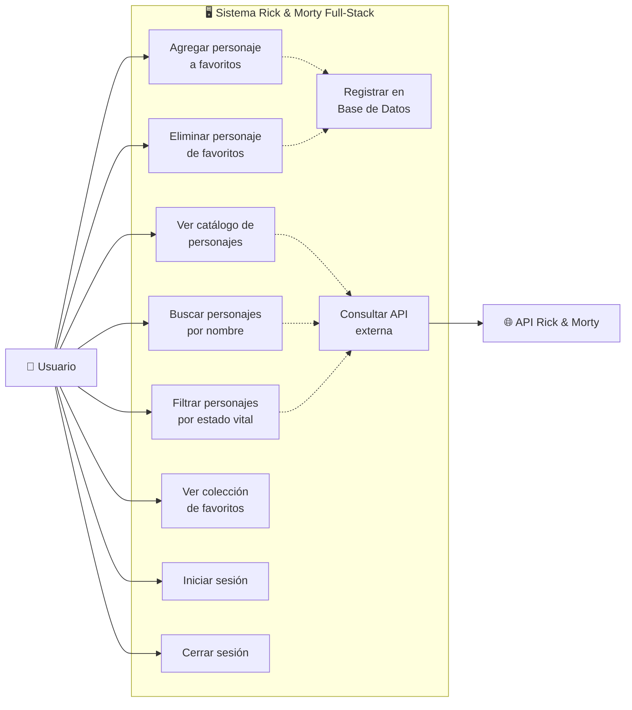

**Descripción de los casos de uso:**

| Caso de Uso | Actor | Descripción |
|------------|-------|-------------|
| CU-01: Ver catálogo | Usuario | Visualizar la grid paginada de personajes con scroll infinito. |
| CU-02: Buscar por nombre | Usuario | Escribir un término de búsqueda que se envía al servidor después de 500ms de debounce. |
| CU-03: Filtrar por estado | Usuario | Seleccionar un filtro de estado vital (vivo/muerto/desconocido) que refresca los resultados. |
| CU-04: Agregar favorito | Usuario | Presionar el botón ⭐ en una tarjeta para agregar el personaje a la colección personal. |
| CU-05: Eliminar favorito | Usuario | Presionar el botón ⭐ (activo) para remover al personaje de favoritos. |
| CU-06: Ver favoritos | Usuario | Navegar a `/favorites` para ver la colección personal completa. |
| CU-07: Iniciar sesión | Usuario | Autenticarse con email y contraseña en `/login`. |
| CU-08: Cerrar sesión | Usuario | Presionar "Desconectar" en el header del dashboard. |

---

### 6.2. Diagrama de Clases / Componentes

Este diagrama modela la estructura de clases y componentes del sistema con sus relaciones de dependencia.

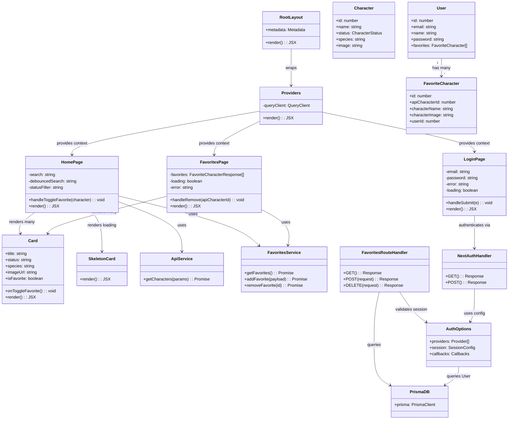

---

### 6.3. Diagrama de Secuencia — Flujo de Autenticación (Login)

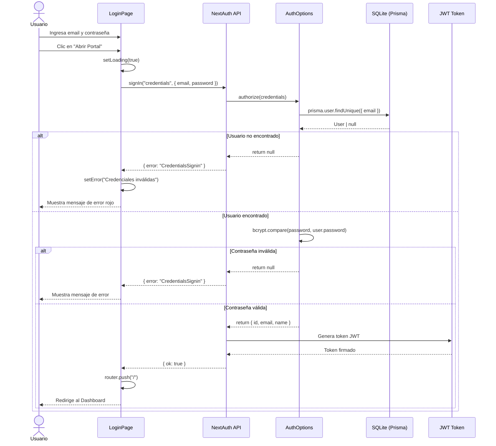

---

### 6.4. Diagrama de Secuencia — Agregar Favorito (Optimistic Update)

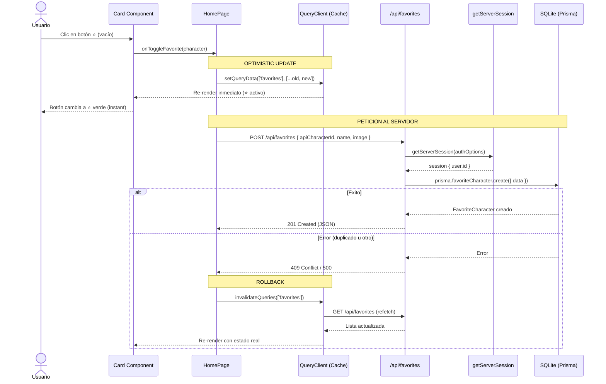

---

### 6.5. Diagrama de Secuencia — Eliminar Favorito

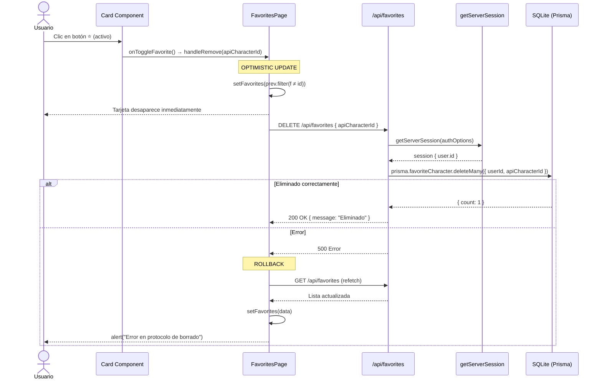

---

### 6.6. Diagrama de Actividad — Flujo General del Sistema

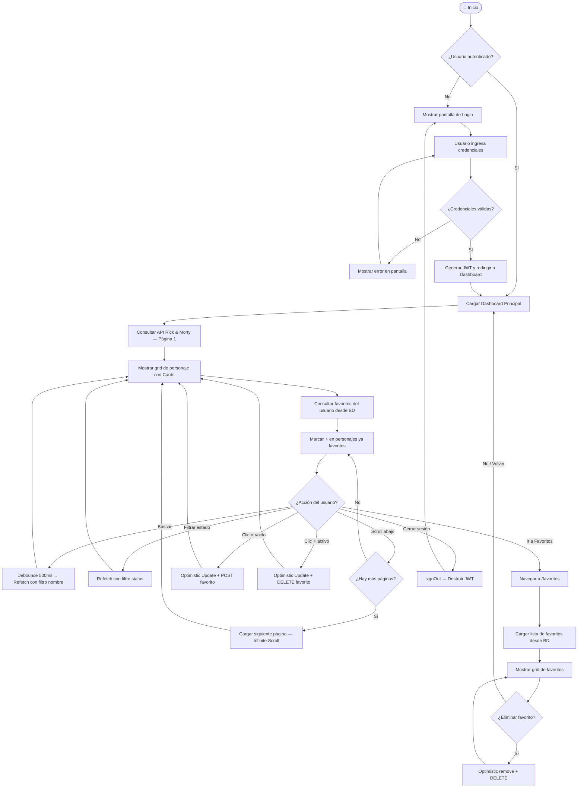

---

# PRODUCTO 3 — PROTOTIPO DE SOLUCIÓN DE SOFTWARE

---

## 7. Wireframes y Mockups de Interfaces

A continuación se presentan los wireframes/mockups de las **pantallas principales** del sistema, describiendo su diseño de interfaces, la navegación entre pantallas y la experiencia de usuario.

### 7.1. Pantalla de Inicio de Sesión (`/login`)

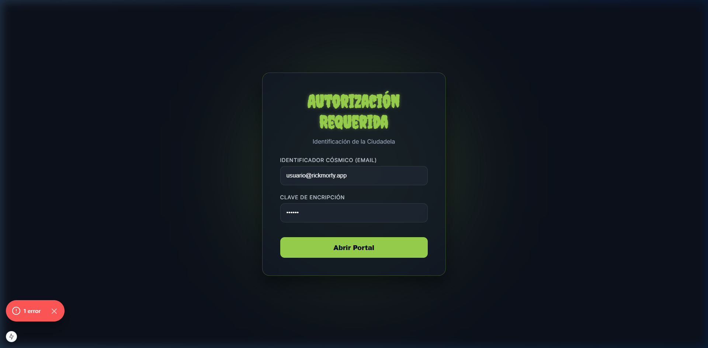

**Descripción de la Interfaz:**

| Elemento | Detalle |
|----------|---------|
| **Fondo** | Color oscuro `#0b101a` con efecto de resplandor radial verde portal (`#97ce4c`) animado (float). |
| **Formulario** | Tarjeta centrada con glassmorphism: fondo semi-transparente, `backdrop-filter: blur(16px)`, borde sutil verde, border-radius 20px. |
| **Título** | "Autorización Requerida" en tipografía *Creepster* con color verde portal y text-shadow. |
| **Subtítulo** | "Identificación de la Ciudadela" en color slate (`#94a3b8`). |
| **Campos** | Dos inputs estilizados: email ("Identificador Cósmico") y password ("Clave de Encripción"). Fondo oscuro, bordes sutiles, focus con glow verde. |
| **Botón** | "Abrir Portal" — fondo verde sólido `#97ce4c`, hover con elevación y box-shadow. |
| **Error** | Banner rojo con borde y fondo semi-transparente para credenciales inválidas. |

**Navegación:** Login exitoso → redirige a `/` (Dashboard).

---

### 7.2. Dashboard Principal — Catálogo de Personajes (`/`)

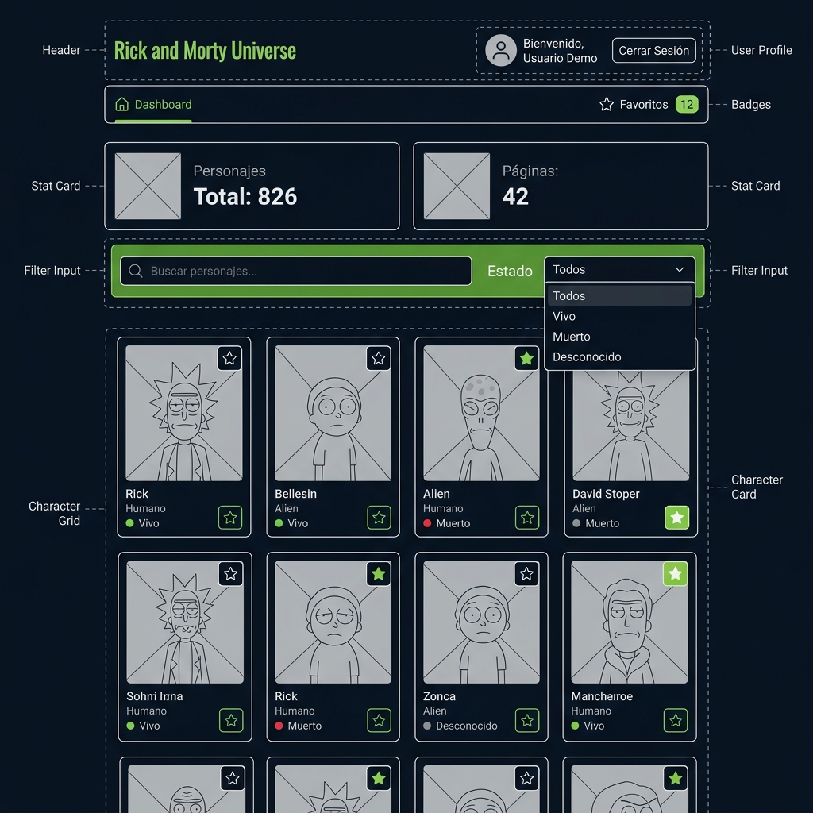

**Descripción de la Interfaz:**

| Elemento | Detalle |
|----------|---------|
| **Header** | Barra superior con saludo al usuario ("Bienvenido, {nombre}") y botón "Desconectar" en rojo sutil. |
| **Título** | "Rick and Morty Universe" en Creepster con gradiente verde→cian. |
| **Enlace Favoritos** | Botón pill con ícono ⭐ animado, texto "Directorio de Favoritos" y badge con contador. |
| **Estadísticas** | 2 stat cards con glassmorphism: "Personajes (Server)" en cian y "Páginas Totales" en verde portal. |
| **Filtros** | Barra de filtros con input de búsqueda (ícono lupa) y select de estado vital, ambos con fondo oscuro y focus verde. |
| **Grid** | Grid responsive (`auto-fill, minmax(290px, 1fr)`) con gap de 2.5rem. |
| **Cards** | Tarjetas con: imagen del personaje (220px, zoom en hover), overlay gradiente, nombre, especie, indicador de estado con dot de color (verde=Alive, rojo=Dead, gris=Unknown), y botón ⭐ de favorito. |
| **Skeleton** | Durante carga: 12 SkeletonCards con animación pulse. |
| **Scroll Infinito** | Trigger invisible al final de la grid que carga la siguiente página automáticamente. |

**Efectos y Animaciones:**
- Portales animados (background blobs con blur y rotación lenta)
- Cards con `slideUp` al montar
- Hover: `translateY(-8px) scale(1.02)` + portal glow
- ⭐ favorito: animación `heartPop` al activar

---

### 7.3. Colección de Favoritos (`/favorites`)

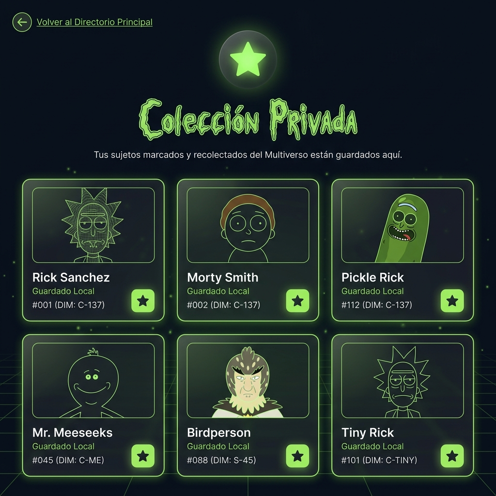

**Descripción de la Interfaz:**

| Elemento | Detalle |
|----------|---------|
| **Navegación** | Enlace "← Volver al Directorio Principal" con hover animado (traslación + glow). |
| **Ícono** | Estrella grande con efecto floatGlow (traslación vertical + drop-shadow pulsante). |
| **Título** | "Colección Privada" en Creepster con text-shadow verde. |
| **Subtítulo** | Dinámico: muestra conteo de favoritos o mensaje vacío invitando a explorar. |
| **Grid** | Misma grid responsive que el Dashboard, con tarjetas Card reutilizadas. |
| **Cards** | Muestran el nombre real del personaje, "Guardado Local" como estado, "Registro #{id}" como especie, imagen persistida, y botón ⭐ activo para eliminar. |
| **Animación** | Cards entran con `fadeInUp` escalonado (delay incrementa por 0.05s por card). |

**Navegación:**
- "Volver al Directorio Principal" → `/` (Dashboard)
- Clic ⭐ → Elimina el favorito (optimistic + DELETE)

---

### 7.4. Mapa de Navegación

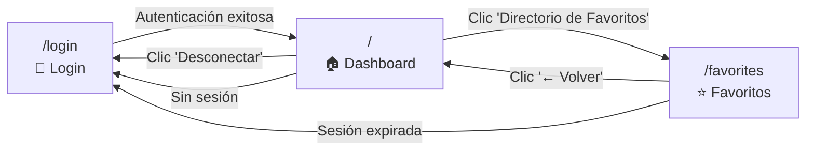

---

### 7.5. Formularios de Creación / Edición

#### Formulario de Login (`/login`)

| Campo | Tipo | Validación | Valor por defecto |
|-------|------|-----------|-------------------|
| Email | `input[type=email]` | Requerido, formato email | `usuario@rickmorty.app` |
| Contraseña | `input[type=password]` | Requerido | `123456` |

#### Formulario implícito de "Agregar Favorito" (Clic en ⭐)

No es un formulario visual; se ejecuta programáticamente al hacer clic en el botón de favorito de una Card:

| Dato | Tipo | Fuente |
|------|------|--------|
| `apiCharacterId` | `number` | `character.id` de la API |
| `characterName` | `string` | `character.name` de la API |
| `characterImage` | `string` | `character.image` de la API |

Se envía como JSON vía `POST /api/favorites`.

---

# PRODUCTO 4 — MODELO DE BASE DE DATOS

---

## 8. Modelo de Base de Datos (Relacional)

### 8.1. Diagrama Entidad-Relación (DER)

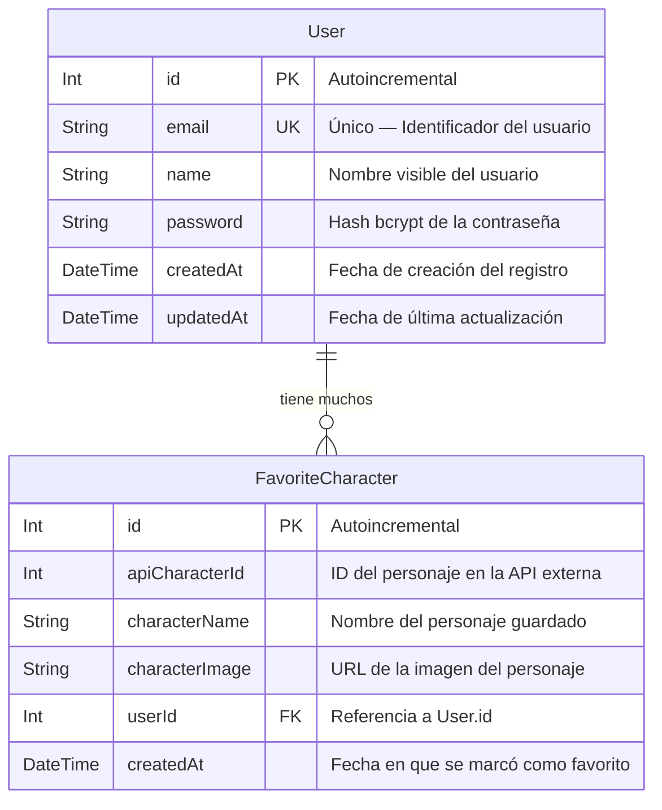

### 8.2. Descripción de Tablas

#### Tabla `User`

| Campo | Tipo | Restricción | Descripción |
|-------|------|-------------|-------------|
| `id` | `Int` | **PK**, Autoincrement | Identificador único del usuario. |
| `email` | `String` | **UNIQUE**, NOT NULL | Correo electrónico utilizado como identificador de login. |
| `name` | `String` | NOT NULL | Nombre visible del usuario en la interfaz. |
| `password` | `String` | NOT NULL, DEFAULT (hash) | Contraseña hasheada con bcrypt (salt rounds: 10). |
| `createdAt` | `DateTime` | DEFAULT `now()` | Timestamp de creación del registro. |
| `updatedAt` | `DateTime` | Auto-actualizado (`@updatedAt`) | Timestamp de última modificación del registro. |

#### Tabla `FavoriteCharacter`

| Campo | Tipo | Restricción | Descripción |
|-------|------|-------------|-------------|
| `id` | `Int` | **PK**, Autoincrement | Identificador único del registro de favorito. |
| `apiCharacterId` | `Int` | NOT NULL | ID del personaje en la API pública de Rick & Morty. |
| `characterName` | `String` | NOT NULL | Nombre del personaje al momento de ser guardado. |
| `characterImage` | `String` | NOT NULL | URL de la imagen del personaje al momento de ser guardado. |
| `userId` | `Int` | **FK** → `User.id`, NOT NULL | Referencia al usuario propietario del favorito. |
| `createdAt` | `DateTime` | DEFAULT `now()` | Timestamp de cuándo se marcó como favorito. |

### 8.3. Relaciones entre Entidades

| Relación | Tipo | Descripción | Regla de eliminación |
|----------|------|-------------|---------------------|
| `User` → `FavoriteCharacter` | **Uno a Muchos** (1:N) | Un usuario puede tener muchos personajes favoritos. Un personaje favorito pertenece a exactamente un usuario. | `ON DELETE CASCADE` — Al eliminar un usuario, se eliminan automáticamente todos sus favoritos. |

### 8.4. Índices y Restricciones

| Tabla | Índice / Restricción | Campos | Propósito |
|-------|---------------------|--------|-----------|
| `User` | UNIQUE | `email` | Garantiza que no existan dos usuarios con el mismo email. |
| `FavoriteCharacter` | UNIQUE COMPOUND | `(userId, apiCharacterId)` | Impide que un usuario guarde el mismo personaje como favorito más de una vez. Genera error `409 Conflict` en el API. |
| `FavoriteCharacter` | FOREIGN KEY | `userId → User.id` | Integridad referencial entre favoritos y usuarios. |

### 8.5. Schema Prisma (Código Fuente)

```prisma
generator client {
  provider = "prisma-client-js"
}

datasource db {
  provider = "sqlite"
  url      = env("DATABASE_URL")
}

model User {
  id        Int                @id @default(autoincrement())
  email     String             @unique
  name      String
  password  String             @default("$2a$10$...")

  favorites FavoriteCharacter[]

  createdAt DateTime           @default(now())
  updatedAt DateTime           @updatedAt
}

model FavoriteCharacter {
  id              Int      @id @default(autoincrement())
  apiCharacterId  Int
  characterName   String
  characterImage  String

  userId Int
  user   User @relation(fields: [userId], references: [id], onDelete: Cascade)

  createdAt DateTime @default(now())

  @@unique([userId, apiCharacterId])
}
```

### 8.6. Datos de Seed (Inicialización)

El sistema incluye un script de seed (`prisma/seed.ts`) que se ejecuta con `npx prisma db seed`:

| Campo | Valor |
|-------|-------|
| Email | `usuario@rickmorty.app` |
| Nombre | `Usuario Demo` |
| Contraseña (plana) | `123456` |
| Contraseña (hash) | Generada con `bcrypt.hash('123456', 10)` |

---

## 9. Endpoints REST — Referencia Rápida

| Método | Ruta | Autenticación | Descripción | Códigos |
|--------|------|---------------|-------------|---------|
| `POST` | `/api/auth/[...nextauth]` | — | Login con credentials | 200, 401 |
| `GET` | `/api/favorites` | ✅ JWT | Listar favoritos del usuario | 200, 401, 500 |
| `POST` | `/api/favorites` | ✅ JWT | Agregar un favorito | 201, 400, 401, 409, 500 |
| `DELETE` | `/api/favorites` | ✅ JWT | Eliminar un favorito | 200, 401, 404, 500 |

---

> **Documento elaborado como evidencia de producto para la Norma 220501095 — SENA.**  
> Todas las secciones cubren los criterios de evaluación: Documento de diseño, Diagramas UML, Prototipo de solución y Modelo de base de datos.
